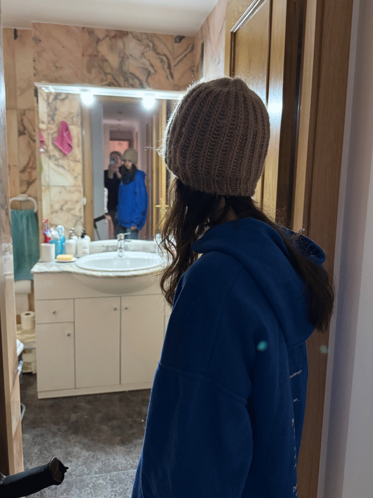

<h2 align="left">Hi 👋 My name is Judith but you can call me Judysu!</h2>

###

###

  
  
  
  
  
  
  
  
  
  
  
  
  
  
  
  
  
  
  
  
  
  
  
  
  
  
  
  
  
  
  
  
  
  
  
  
  

###

  
  
  

###

<picture>
  <source media="(prefers-color-scheme: dark)" srcset="https://raw.githubusercontent.com/Yuta-chan/Yuta-chan/output/github-snake-dark.svg" />
  <source media="(prefers-color-scheme: light)" srcset="https://raw.githubusercontent.com/Yuta-chan/Yuta-chan/output/github-snake.svg" />
  
</picture>
